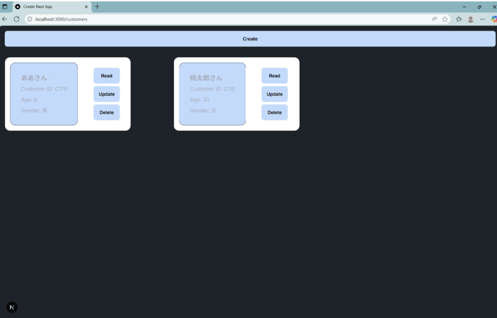

+++++++++++++++++++++++++++++++++++++++++++++++++++++++++++++++++++++++++++++++++++++++
　　　　YOKOが追記したREADME
+++++++++++++++++++++++++++++++++++++++++++++++++++++++++++++++++++++++++++++++++++++++
## 課題概要
- 下記のgithubからコードを落としてきて、3つのエラーを解消する
- コード： https://github.com/Tech0-SWAT/LinkFastAPINext_Practical

## 感想
- いやこれはむずい。「わかるわけないやろ」ってツッコみながら課題の回答を見ていた
- 経験積んで理解を深めていくしかないんだろうな。
- ターミナルのエラーの読み方や画面上のエラーの読み方にチャレンジした。
- Tips
    - ターミナルのエラーは処理順に表示される
    ‐ デバックでは、処理状況をログに出してみるのが非常に有効
        - バックエンド：print()
        - フロントエンド：console.log()

## 実行の手順：バックエンド（FastAPI）とフロントエンド（Next.js）をそれぞれターミナルを開き起動させる

### バックエンド（FastAPI）
  1. cd backend　!　backendのフォルダに移動する
  2. python -m venv backend_env　!　仮想環境を構築する手順なので構築初回のみ必要でそれ以降は不要な手順
  3. .\backend_env\Scripts\activate　!　仮想環境を有効化する
  4. pip install -r requirements.txt　!　インストールなのでこちらも手順2と同様に構築初回のみ必要でそれ以降は不要な手順
  5. uvicorn app:app --reload　!　FastAPIを起動する

### フロントエンド（Next.js）
  1. cd frontend　! frontendのフォルダに移動する
  2. npm install　! npmのインストールなのでこちらも構築初回のみ必要でそれ以降は不要な手順
  3. npm run dev
  4. http://localhost:3000/customers にアクセス
　
### 仕様
#### 画面仕様 

#### 処理の流れと依存関係  
    [ホーム画面（page.jsx）]
    │
    └─▶ useEffect により初回レンダリング時に fetchCustomers() を呼び出し
            │
            └─▶ fetchCustomers.js
                    └─▶ fetch(process.env.NEXT_PUBLIC_API_ENDPOINT + "/allcustomers")
                            └─▶ FastAPI: GET /allcustomers
                                    └─▶ SQLAlchemy: SELECT * FROM customers
                                    └─▶ DBから顧客一覧を取得
                    └─▶ JSONレスポンスを受け取り、customerInfos にセット
    └─▶ customerInfos.map(...) により顧客一覧を描画
            └─▶ OneCustomerInfoCard.jsx（1人分のカード表示）
                    └─▶ 顧客名・ID・年齢・性別を表示

    └─▶ 各顧客カードに操作ボタン（Link）
            ├─▶ [Read] → /customers/read/[customer_id]
            │       └─▶ FastAPI: GET /customers?customer_id=xxx
            │               └─▶ SQLAlchemy: SELECT WHERE customer_id = xxx
            │               └─▶ 顧客詳細を表示
            ├─▶ [Update] → /customers/update/[customer_id]
            │       └─▶ 顧客編集画面へ遷移
            └─▶ [Delete] → /customers/delete/[customer_id]
                    └─▶ 顧客削除画面へ遷移

+++++++++++++++++++++++++++++++++++++++++++++++++++++++++++++++++++++++++++++++++++++++
　　　　以下は、元々課題で用意されていたREADME
+++++++++++++++++++++++++++++++++++++++++++++++++++++++++++++++++++++++++++++++++++++++

This is a FastAPI-Next.js repo

### git clone https://github.com/suzuyu33z/Practical_10.git

■ backend

- cd backend
- python3 -m venv backend_env (backend_env という名前の仮想環境を作成)
- ./backend_env/Script/activate.ps1 (powershell の場合)
- source backend_env/bin/activate (macOS/Linux の場合)
- pip install -r requirements.txt
- uvicorn app:app --reload

■ frontend

- cd frontend
- npm install
- npm run dev

■ http://localhost:3000/customers にアクセス
